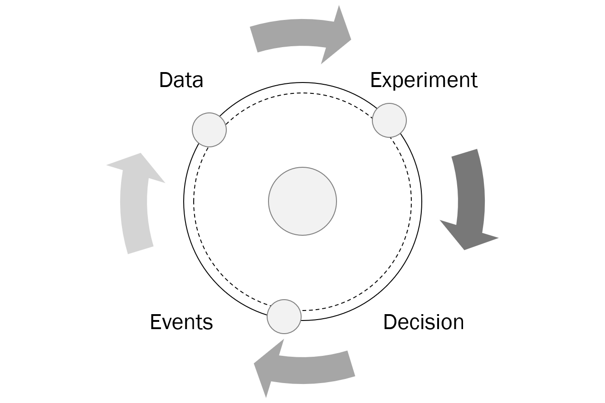

# The data (and AI) flywheel

## A brief history of the flywheel
The flywheel has been mentioned in management practices (Good to Great, AI, Amazon) on how to operate a business and gain momentum. Historically the term was associated with business market momentum, and then eventually the feedback loop that feeds artificial intelligence models. Ultimately, Amazon (and others) generalized this to the *data flywheel* which doesn't rely on Artificial Intelligence but instead relies on data-driven decision making to learn and adapt at a rapid pace. 

## What is the flywheel?

As the system operates, more data is collected, more is learned, and the process improves. The system continuously improves itself, becoming increasingly value for the business and consumers.

### References
1. Amazon, *The Data Flywheel*, https://pages.awscloud.com/data-flywheel.html
2. Google, *A look back at AI in 2019*, https://ai.googleblog.com/2020/01/google-research-looking-back-at-2019.html
